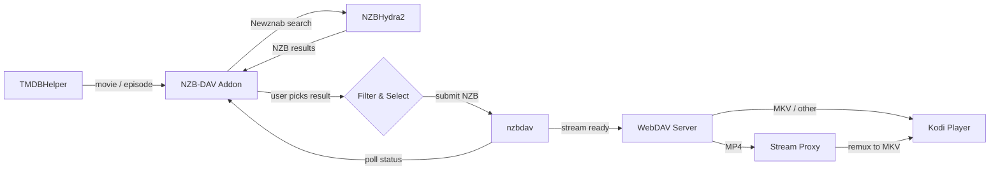

# NZB-DAV Kodi Addon

[](https://github.com/xbmc4lyfe/nzbdavkodi/actions/workflows/ci.yml)
[](https://github.com/xbmc4lyfe/nzbdavkodi/actions/workflows/pylint.yml)
[](https://github.com/xbmc4lyfe/nzbdavkodi/actions/workflows/codeql.yml)
[](https://github.com/xbmc4lyfe/nzbdavkodi/actions/workflows/release.yml)
[](https://coderabbit.ai)
[](https://www.gnu.org/licenses/gpl-3.0)
[](https://kodi.tv/)
[](https://www.python.org/)

A Kodi 21 (Omega) player/resolver addon that enables Usenet-based streaming through NZBHydra2 and nzbdav. Works as a TMDBHelper player -- search for a movie or TV episode, pick an NZB, and stream it directly through nzbdav's WebDAV server.

## How It Works



No separate SABnzbd needed -- nzbdav handles both downloading and serving.

## MP4 Stream Proxy

MP4 files are automatically remuxed to MKV on the fly through a local ffmpeg proxy. This works around a 32-bit Kodi `CFileCache` bug where parsing large MP4 moov atoms over HTTP fails with "corrupted data" errors. MKV and other formats play directly without the proxy.

The proxy runs as a background service (`service.py`) on a random local port. When an MP4 is requested:

1. **Duration probe** -- ffmpeg reads just the file header to get the total duration, then exits immediately
2. **Remux** -- `ffmpeg -c:v copy -c:a copy -c:s srt -f matroska pipe:1` streams the remuxed MKV back to Kodi with no re-encoding
3. **Subtitle conversion** -- MP4 `mov_text` subtitles are converted to SRT for MKV compatibility (toggleable in settings)
4. **Seeking** -- Kodi's progress bar and seek controls work by mapping byte offsets to time positions; the proxy kills and respawns ffmpeg with `-ss` at the calculated timestamp
5. **Graceful fallback** -- if ffmpeg is not installed, MP4 files play directly (no remux, no seeking)

## Requirements

| Component | Description |
|-----------|-------------|
| **Kodi 21 (Omega)** | Or later |
| **NZBHydra2** | Running and accessible |
| **nzbdav** | Running and accessible (provides SABnzbd-compatible API + WebDAV) |
| **TMDBHelper** | To trigger searches |

## Installation

### Via Kodi Repository (recommended)

Install through the NZB-DAV repository for automatic updates:

1. In Kodi: **Settings > File Manager > Add source** > enter `https://xbmc4lyfe.github.io/nzbdavkodi/` > name it `nzbdav`
2. **Settings > Add-ons > Install from zip file** > `nzbdav` > `repository.nzbdav` > `repository.nzbdav-1.0.0.zip`
3. **Settings > Add-ons > Install from repository > NZB-DAV Repository > Video add-ons > NZB-DAV**
4. Future updates are installed automatically

### Manual Install

1. Download the addon zip from the [releases page](../../releases)
2. In Kodi: **Settings > Add-ons > Install from zip file** > select `plugin.video.nzbdav.zip`

---

## TMDBHelper Setup

NZB-DAV works as a player for TMDBHelper, which provides the movie/TV browsing interface. If you don't have TMDBHelper installed yet:

### 1. Install TMDBHelper

TMDBHelper is available from the official Kodi repository:

1. **Settings > Add-ons > Install from repository > Kodi Add-on repository > Video add-ons > TheMovieDb Helper**
2. Click **Install** and wait for the notification

If it's not in the official repo for your Kodi version, install from the [TMDBHelper GitHub releases](https://github.com/jurialmunkey/plugin.video.themoviedb.helper/releases):

1. Download the latest `plugin.video.themoviedb.helper` zip
2. **Settings > Add-ons > Install from zip file** > select the downloaded zip

### 2. Configure TMDBHelper

1. Open TMDBHelper settings: **Add-ons > My add-ons > Video add-ons > TheMovieDb Helper > Configure**
2. Under **API Keys**, enter a [TMDB API key](https://www.themoviedb.org/settings/api) (free account required)
3. Under **Players**, set **Default player** to **NZB-DAV** for both Movies and TV Shows

### 3. Install the NZB-DAV Player File

The player file tells TMDBHelper how to call NZB-DAV:

1. Open NZB-DAV settings: **Add-ons > My add-ons > Video add-ons > NZB-DAV > Configure**
2. Click **Install Player File** (installs directly to TMDBHelper)
3. Restart Kodi (or go to TMDBHelper settings > **Players** > **Update players**)

### 4. Set NZB-DAV as the Default Player

1. Open TMDBHelper settings > **Players**
2. Set **Default player (Movies)** to **NZB-DAV**
3. Set **Default player (TV Shows)** to **NZB-DAV**

With this configured, selecting any movie or episode in TMDBHelper will automatically search and stream via NZB-DAV without a player selection prompt.

> **Tip:** If you want to keep multiple players available (e.g., NZB-DAV + a Debrid service), leave the default player as **Choose** and you'll get a player selection dialog each time.

---

## Configuration

Open the addon settings (**Add-ons > My add-ons > Video add-ons > NZB-DAV > Configure**):


### Connection Settings

| Setting | Where to find it |
|---------|-----------------|
| NZBHydra2 URL | URL to your NZBHydra2 instance (e.g., `http://192.168.1.100:5076`) |
| NZBHydra2 API Key | NZBHydra2 web UI > `http://<hydra>:5076/config/main` > **Security** section > **API key** |
| nzbdav URL | URL to your nzbdav instance (e.g., `http://192.168.1.100:3333`) |
| nzbdav API Key | nzbdav web UI > `http://<nzbdav>/settings` > **Usenet** tab > **API Key** |
| WebDAV Username | nzbdav web UI > `http://<nzbdav>/settings` > **WebDAV** tab > **Username** |
| WebDAV Password | nzbdav web UI > `http://<nzbdav>/settings` > **WebDAV** tab > **Password** |

> **Tip for entering long API keys:** Use a Kodi remote app with keyboard support (e.g., Sybu on iPhone). Navigate to the nzbdav/NZBHydra2 settings page on your computer, copy the key, then paste from your clipboard into the Kodi input field via the remote app's on-screen keyboard.

### Player Installation

Click **Install Player File** to install the `nzbdav.json` player to TMDBHelper. This registers NZB-DAV as a playback source in TMDBHelper's player selection menu. The player is installed directly to TMDBHelper's players directory.

### Quality Filters

All filters default to **everything enabled** -- deselect what you don't want.

| Filter | Options |
|--------|---------|
| Resolution | 2160p, 1080p, 720p, 480p |
| HDR | HDR10, HDR10+, Dolby Vision, HLG, SDR |
| Audio | Atmos, TrueHD, DTS-HD MA, DTS:X, DD+, DD, AAC |
| Video Codec | x265/HEVC, x264/AVC, AV1, VP9, MPEG-2 |
| Language | EN, ES, FR, DE, IT, PT, NL, RU, JA, KO, ZH, AR, HI |

### Keyword Filters

| Setting | Description |
|---------|-------------|
| Preferred release groups | Comma-separated (e.g., `SPARKS,FGT,NTb`) -- boosted to top |
| Excluded release groups | Comma-separated -- removed from results |
| Min file size | In MB (0 = no limit) |
| Max file size | In MB (0 = no limit) |
| Exclude keywords | Comma-separated |
| Require keywords | Comma-separated |

### Sort & Display

| Setting | Options | Default |
|---------|---------|---------|
| Sort by | Relevance, Size (largest/smallest), Age (newest/oldest) | Relevance |
| Max results | 1--100 | 25 |

### Relevance Sort Order

When sorted by relevance, results are ranked by priority:

| Priority | Criteria | Ranking |
|----------|----------|---------|
| 1 | Resolution | 4K > 1080p > 720p > 480p |
| 2 | HDR | Dolby Vision > HDR10+ > HDR10 > HLG > SDR |
| 3 | Preferred group | Configured groups boosted |
| 4 | Audio | TrueHD+Atmos > Atmos DD+ > TrueHD > DTS:X > DTS-HD MA > DTS > DD+ > DD > AAC |
| 5 | Size | Largest first |

### Polling

| Setting | Description | Default |
|---------|-------------|---------|
| Poll interval | Seconds between status checks | 5 |
| Download timeout | Max wait time in seconds | 3600 |

### Search Cache

| Setting | Description | Default |
|---------|-------------|---------|
| Cache duration | Seconds to cache search results (0 to disable) | 300 |
| Clear Cache | Available from addon main menu | -- |

### Auto-Select

| Setting | Description | Default |
|---------|-------------|---------|
| Auto-select best match | Automatically pick the top result and skip the selection dialog | Off |

---

## Usage

1. Open **TMDBHelper** and browse to a movie or TV episode
2. Select **Play with NZB-DAV**
3. Pick an NZB from the full-screen results dialog
4. Wait for the download to complete (progress dialog shows status)
5. Playback starts automatically from nzbdav's WebDAV server

### Results Dialog

The results dialog shows all matching NZBs with color-coded quality labels, sorted by relevance. Each row displays the release name, resolution, codec, audio format, release type, file size, age, indexer, and release group.


The status bar at the bottom shows how many sources passed your filters. Use **Enter** to download and play, **C** for the context menu, or **Esc** to go back.

With **Auto-select best match** enabled, the dialog is skipped and the top result plays automatically.

---

## Development

### Prerequisites

- Python 3.8+
- [just](https://github.com/casey/just) (command runner)

### Commands

```bash
just test          # Run all 236 tests
just test-verbose  # Run tests with full output
just lint          # Check ruff + black formatting
just lint-fix      # Auto-fix lint issues
just release       # Build plugin.video.nzbdav.zip
just ship          # Run tests then build release
just repo          # Build release + generate Kodi repo in dist/
just clean         # Remove build artifacts
just dist-clean    # Remove build artifacts + dist/
```

### Project Structure

```
plugin.video.nzbdav/
  addon.xml              # Kodi addon manifest
  addon.py               # Entry point
  service.py             # Background service (stream proxy + playback monitor)
  resources/
    settings.xml         # Kodi settings UI
    lib/
      router.py          # URL routing
      hydra.py           # NZBHydra2 API client
      nzbdav_api.py      # nzbdav API client
      webdav.py          # WebDAV availability checker
      filter.py          # Result filtering with PTT
      results_dialog.py  # Custom full-screen results dialog
      resolver.py        # Download + polling orchestrator
      stream_proxy.py    # Local HTTP proxy -- MP4->MKV remux via ffmpeg
      cache.py           # JSON-based search result cache
      player_installer.py # TMDBHelper player JSON installer
      http_util.py       # Shared HTTP utilities
      i18n.py            # Localization helper
      ptt/               # Vendored PTT library (parse-torrent-title)
    language/             # Kodi localization files
    skins/Default/
      1080i/results-dialog.xml  # Dialog skin XML
      media/white.png           # Texture for backgrounds
scripts/
  build_zip.py           # Addon zip builder
  generate_repo.py       # Kodi repo metadata generator
repo/
  repository.nzbdav/     # Repository addon (points to GitHub Pages)
.github/workflows/
  ci.yml                 # Test + lint on push/PR (Python 3.8/3.10/3.12)
  release.yml            # Build + deploy on version tags
  pylint.yml             # Pylint analysis
  codacy.yml             # Codacy security scan
  codeql.yml             # CodeQL analysis
  bandit.yml             # Bandit security scan
tests/
  conftest.py            # Kodi module mocks
  test_*.py              # 236 tests
```

### Releasing

1. Bump `version` in `plugin.video.nzbdav/addon.xml`
2. Commit: `git commit -am "release: v0.X.0"`
3. Tag and push: `git tag v0.X.0 && git push origin main v0.X.0`
4. GitHub Actions builds the zip, creates a GitHub Release, and updates the Kodi repo on GitHub Pages
5. Kodi picks up the update automatically via the repository

---

## Compatibility

| Platform | Supported |
|----------|-----------|
| Kodi | 21 (Omega) and later |
| Python | 3.8+ |
| OS | CoreELEC, LibreELEC, OSMC, Windows, macOS, Linux |
| Architecture | ARM64 (aarch64), x86_64 |
| Dependencies | None -- all vendored, no pip required |

## License

GPLv3 -- see [LICENSE](LICENSE) for details.
