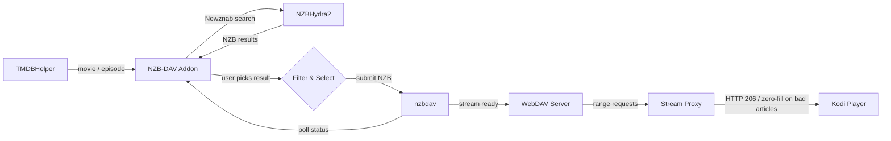
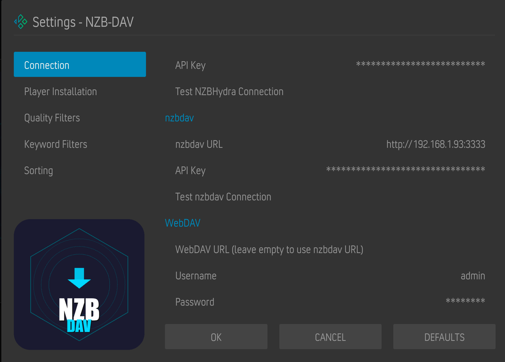

# NZB-DAV Kodi Addon

[](https://github.com/xbmc4lyfe/nzbdavkodi/actions/workflows/ci.yml)
[](https://github.com/xbmc4lyfe/nzbdavkodi/actions/workflows/pylint.yml)
[](https://github.com/xbmc4lyfe/nzbdavkodi/actions/workflows/codeql.yml)
[](https://github.com/xbmc4lyfe/nzbdavkodi/actions/workflows/release.yml)
[](https://coderabbit.ai)
[](https://www.gnu.org/licenses/gpl-3.0)
[](https://kodi.tv/)
[](https://www.python.org/)

A Kodi 21 (Omega) player/resolver addon that enables Usenet-based streaming through NZBHydra2 (or Prowlarr) and nzbdav. Works as a TMDBHelper player -- search for a movie or TV episode, pick an NZB, and stream it directly through nzbdav's WebDAV server.

> **Current release: `v1.0.3`** on `main`. Highlights since the v1.0.0 pre-alpha:
>
> - **Three force-remux modes**: piped matroska (default, DV-safe), fragmented MP4 HLS (full seek, experimental), and direct pass-through (no remux at all when `<cache><memorysize>0</memorysize></cache>` is set in `advancedsettings.xml`).
> - **Prowlarr support** as an alternative indexer to NZBHydra2.
> - **Dolby Vision routing matrix**: P5 / P7 FEL / P8 / unknown DV are routed to matroska automatically; P7 MEL and non-DV go to fmp4 HLS when that mode is selected.
> - **First-play cache dialog** offers the cache=0 setup snippet (Show instructions / Not now / Never ask) the first time force-remux fires on a large file.
> - **Hardening**: co64 chunk-offset support for MP4s ≥ 4 GB, MKV SimpleBlock-lacing rejection, ffmpeg `-headers` CR/LF stripping, cross-origin PROPFIND href trust path.
>
> See [CHANGELOG.md](CHANGELOG.md) for the full per-release record.

## How It Works



No separate SABnzbd needed -- nzbdav handles both downloading and serving.

## Stream Proxy

Every playback request is routed through a local HTTP proxy (`stream_proxy.py`) running on a random port in the background service. Kodi never talks to the WebDAV server directly, which sidesteps a PROPFIND parent-directory scan that caused `Open - Unhandled exception` errors on several Kodi builds.

The proxy picks one of four paths based on the container, file size, and the configured `force_remux_mode`:

1. **MP4 (already faststart)** -- redirected straight to the WebDAV URL; Kodi seeks and plays natively.
2. **MP4 (moov at tail)** -- parsed in pure Python via HTTP range requests, `stco` and `co64` chunk offsets rewritten (so 4 GB+ MP4s work on 32-bit Kodi), and served as a virtual faststart MP4 with `Accept-Ranges: bytes`. If parsing fails, falls back to an ffmpeg tempfile remux.
3. **MKV and other containers (under the force-remux threshold)** -- served as a byte pass-through with ranged upstream fetches. Kodi gets native seeking from the source file's real Cues, and the proxy layers zero-fill recovery on top: when an upstream read fails mid-stream, it probes forward to the next readable offset, writes zero bytes across the gap, and keeps streaming. No more black screen when a single Usenet article is unrecoverable.
4. **Files above the force-remux threshold (default 20 GB)** -- routed by `force_remux_mode`:
   - **Piped Matroska (default, DV-safe)** -- `ffmpeg -c copy -f matroska pipe:1`, unsized. Known-good on Dolby Vision HEVC + TrueHD/Atmos 100 GB REMUXes. Seek is approximate (each seek respawns ffmpeg with `-ss`).
   - **Fragmented MP4 HLS (experimental, opt-in)** -- produces an HLS VOD playlist with per-segment `hvc1`-tagged fMP4 + a canonical `init.mp4` that survives seek respawns. Gives full random seek across multi-hundred-gigabyte sources. **Self-healing**: if ffmpeg fails to start or doesn't produce a valid init segment within 30 s, the proxy automatically rewrites the session to the matroska branch *before* Kodi sees a broken URL.
   - **Direct pass-through (opt-in)** -- no remux at all; bytes flow 1:1 from nzbdav. Requires `<cache><memorysize>0</memorysize></cache>` in `advancedsettings.xml` so 32-bit Kodi's `CFileCache` does not overflow on the source byte count. The addon probes for that setting at startup and falls back to matroska automatically if it is missing.

**Dolby Vision routing matrix** (applied within the force-remux tier): P5, P7 FEL, P8, and unknown-DV sources are routed to **matroska** (the safest option on Amlogic CAMLCodec). P7 MEL and confirmed non-DV are eligible for **fmp4 HLS** when that mode is selected. P7 FEL specifically is forced to matroska because fmp4 cannot carry dual-layer HEVC.

If ffmpeg isn't installed, the proxy degrades gracefully to pass-through or direct redirect.

> **Architecture deep-dive:** [`TODO.md` Part C](TODO.md#part-c--stream-proxy-architecture-reference-proxymd) documents the full session lifecycle, how the proxy interacts with `resolver.py` / `service.py` / `router.py` / `mp4_parser.py`, the HLS producer internals, and where to look when debugging playback failures. (The former standalone `PROXY.md` was consolidated into `TODO.md` on 2026-04-24.)

### Pass-through mode (optional, recommended for large files)

By default, files above the force-remux threshold (20 GB) stream through ffmpeg so 32-bit Kodi's `CFileCache` cannot overflow on the source byte count. You can skip the remux and get pure byte pass-through with full random seek by disabling Kodi's memory cache.

Create or edit `special://profile/advancedsettings.xml` (on CoreELEC: `/storage/.kodi/userdata/advancedsettings.xml`) and merge in:

```xml
<advancedsettings>
  <cache>
    <memorysize>0</memorysize>
  </cache>
</advancedsettings>
```

Restart Kodi for the change to take effect. The addon probes this file and only takes the pass-through path when `memorysize` is `0`; without it, force-remux remains the safe default so large MKVs will not hit the CFileCache overflow.

The addon surfaces this same snippet in a one-off dialog the first time force-remux fires on a large file. The dialog has three buttons:

- **Show instructions** — opens a textviewer with the exact XML snippet to paste.
- **Not now** — dismisses the dialog for the current Kodi session only.
- **Never ask** — sets the persistent `cache_dialog_dismissed` flag so the dialog does not return.

The addon never writes to `advancedsettings.xml` itself — merging the snippet is left to the user so existing `<video>` / `<network>` / `<videodatabase>` entries are preserved.

## Requirements

| Component | Description |
|-----------|-------------|
| **Kodi 21 (Omega)** | Or later |
| **NZBHydra2** *or* **Prowlarr** | At least one indexer aggregator running and accessible |
| **nzbdav** | Running and accessible (provides SABnzbd-compatible API + WebDAV) |
| **TMDBHelper** | To trigger searches |
| **ffmpeg** *(recommended)* | Required for force-remux. Without it the proxy falls back to pass-through / direct redirect for all files. |

## Installation

### Via Kodi Repository (recommended)

Install through the NZB-DAV repository for automatic updates:

1. In Kodi: **Settings > File Manager > Add source** > enter `https://xbmc4lyfe.github.io/nzbdavkodi/` > name it `nzbdav`
2. **Settings > Add-ons > Install from zip file** > `nzbdav` > `repository.nzbdav` > `repository.nzbdav-1.0.0.zip`
3. **Settings > Add-ons > Install from repository > NZB-DAV Repository > Video add-ons > NZB-DAV**
4. Future updates are installed automatically

### Manual Install

1. Download the addon zip from the [releases page](../../releases)
2. In Kodi: **Settings > Add-ons > Install from zip file** > select `plugin.video.nzbdav.zip`

---

## TMDBHelper Setup

NZB-DAV works as a player for TMDBHelper, which provides the movie/TV browsing interface. If you don't have TMDBHelper installed yet:

### 1. Install TMDBHelper

TMDBHelper is available from the official Kodi repository:

1. **Settings > Add-ons > Install from repository > Kodi Add-on repository > Video add-ons > TheMovieDb Helper**
2. Click **Install** and wait for the notification

If it's not in the official repo for your Kodi version, install from the [TMDBHelper GitHub releases](https://github.com/jurialmunkey/plugin.video.themoviedb.helper/releases):

1. Download the latest `plugin.video.themoviedb.helper` zip
2. **Settings > Add-ons > Install from zip file** > select the downloaded zip

### 2. Configure TMDBHelper

1. Open TMDBHelper settings: **Add-ons > My add-ons > Video add-ons > TheMovieDb Helper > Configure**
2. Under **API Keys**, enter a [TMDB API key](https://www.themoviedb.org/settings/api) (free account required)
3. Under **Players**, set **Default player** to **NZB-DAV** for both Movies and TV Shows

### 3. Install the NZB-DAV Player File

The player file tells TMDBHelper how to call NZB-DAV:

1. Open NZB-DAV settings: **Add-ons > My add-ons > Video add-ons > NZB-DAV > Configure**
2. Click **Install Player File** (installs directly to TMDBHelper)
3. Restart Kodi (or go to TMDBHelper settings > **Players** > **Update players**)

### 4. Set NZB-DAV as the Default Player

1. Open TMDBHelper settings > **Players**
2. Set **Default player (Movies)** to **NZB-DAV**
3. Set **Default player (TV Shows)** to **NZB-DAV**

With this configured, selecting any movie or episode in TMDBHelper will automatically search and stream via NZB-DAV without a player selection prompt.

> **Tip:** If you want to keep multiple players available (e.g., NZB-DAV + a Debrid service), leave the default player as **Choose** and you'll get a player selection dialog each time.

---

## Configuration

Open the addon settings (**Add-ons > My add-ons > Video add-ons > NZB-DAV > Configure**):



### Connection Settings

| Setting | Where to find it |
|---------|-----------------|
| NZBHydra2 URL | URL to your NZBHydra2 instance (e.g., `http://192.168.1.100:5076`) |
| NZBHydra2 API Key | NZBHydra2 web UI > `http://<hydra>:5076/config/main` > **Security** section > **API key** |
| nzbdav URL | URL to your nzbdav instance (e.g., `http://192.168.1.100:3333`) |
| nzbdav API Key | nzbdav web UI > `http://<nzbdav>/settings` > **Usenet** tab > **API Key** |
| WebDAV Username | nzbdav web UI > `http://<nzbdav>/settings` > **WebDAV** tab > **Username** |
| WebDAV Password | nzbdav web UI > `http://<nzbdav>/settings` > **WebDAV** tab > **Password** |

#### Prowlarr (optional, alternative to NZBHydra2)

Enable **Prowlarr** in addon settings to use Prowlarr as the search backend instead of (or alongside) NZBHydra2:

| Setting | Description |
|---------|-------------|
| Enable Prowlarr | Turn on Prowlarr search |
| Prowlarr URL | URL to your Prowlarr instance (e.g., `http://localhost:9696`) |
| Prowlarr API Key | Prowlarr web UI > **Settings > General > Security** > API Key |
| Prowlarr Indexer IDs | Comma-separated indexer IDs to query (leave blank for all) |
| Test Prowlarr Connection | Action button — verifies URL + API key + indexer reachability |

> **Tip for entering long API keys:** Use a Kodi remote app with keyboard support (e.g., Sybu on iPhone). Navigate to the nzbdav/NZBHydra2/Prowlarr settings page on your computer, copy the key, then paste from your clipboard into the Kodi input field via the remote app's on-screen keyboard.

### Player Installation

Click **Install Player File** to install the `nzbdav.json` player to TMDBHelper. This registers NZB-DAV as a playback source in TMDBHelper's player selection menu. The player is installed directly to TMDBHelper's players directory.

### Quality Filters

All filters default to **everything enabled** -- deselect what you don't want.

| Filter | Options |
|--------|---------|
| Resolution | 2160p, 1080p, 720p, 480p |
| HDR | HDR10, HDR10+, Dolby Vision, HLG, SDR |
| Audio | Atmos, TrueHD, DTS-HD MA, DTS:X, DD+, DD, AAC |
| Video Codec | x265/HEVC, x264/AVC, AV1, VP9, MPEG-2 |
| Language | EN, ES, FR, DE, IT, PT, NL, RU, JA, KO, ZH, AR, HI |

### Keyword Filters

| Setting | Description |
|---------|-------------|
| Preferred release groups | Comma-separated (e.g., `SPARKS,FGT,NTb`) -- boosted to top |
| Excluded release groups | Comma-separated -- removed from results |
| Min file size | In MB (0 = no limit) |
| Max file size | In MB (0 = no limit) |
| Exclude keywords | Comma-separated |
| Require keywords | Comma-separated |

### Sort & Display

| Setting | Options | Default |
|---------|---------|---------|
| Sort by | Relevance, Size (largest/smallest), Age (newest/oldest) | Relevance |
| Max results | 1--100 | 25 |

### Relevance Sort Order

When sorted by relevance, results are ranked by priority:

| Priority | Criteria | Ranking |
|----------|----------|---------|
| 1 | Resolution | 4K > 1080p > 720p > 480p |
| 2 | HDR | Dolby Vision > HDR10+ > HDR10 > HLG > SDR |
| 3 | Preferred group | Configured groups boosted |
| 4 | Audio | TrueHD+Atmos > Atmos DD+ > TrueHD > DTS:X > DTS-HD MA > DTS > DD+ > DD > AAC |
| 5 | Size | Largest first |

### Polling

| Setting | Description | Default |
|---------|-------------|---------|
| Poll interval | Seconds between status checks | 5 |
| Download timeout | Max wait time in seconds | 3600 |
| Submit timeout | Max wait for nzbdav submit-NZB API to respond (seconds) | 120 |

### Search Cache

| Setting | Description | Default |
|---------|-------------|---------|
| Cache duration | Seconds to cache search results (0 to disable) | 300 |
| Clear Cache | Available from addon main menu | -- |

### Auto-Select

| Setting | Description | Default |
|---------|-------------|---------|
| Auto-select best match | Automatically pick the top result and skip the selection dialog | Off |

### Advanced

These tune stream-proxy behaviour. Defaults are safe; only flip these if you have a reason.

| Setting | Description | Default |
|---------|-------------|---------|
| Force remux output format | `Piped Matroska (seek limited, DV-safe)` / `Fragmented MP4 HLS (full seek, DV-capable, experimental)` / `Direct pass-through (requires advancedsettings.xml cache=0)` | Piped Matroska |
| Force ffmpeg remux above (MB, 0=off) | File size above which the proxy switches to the force-remux tier (0 disables remux entirely) | 20000 (~20 GB) |
| Convert MP4 subtitles to SRT | mov_text → SRT during remux so embedded subs survive the matroska/HLS pipeline | On |
| Strict contract mode | How to react when nzbdav responds with HTTP shapes that violate the strict Range/Content-Length contract: `Off` / `Warn only` / `Enforce` | Warn only |
| Density breaker | Abort streams where recovery zero-fill exceeds 50% of a sliding window (catches dead releases early) | Off |
| Zero-fill budget | Cap total per-stream zero-fill bytes; stream terminates with a clean error when the budget is hit | On |
| Retry ladder | Re-issue the original Range request with backoff on transient upstream errors before falling back to skip-fill | On |
| Send 200 for no-range pass-through | Send `200 OK` instead of always `206 Partial Content` when Kodi requests a full object. **Off by default** until validated on the target build. | Off |
| Cache dialog dismissed | Persistent flag set when you click "Never ask" on the first-play cache=0 dialog | Off |

1. Open **TMDBHelper** and browse to a movie or TV episode
2. Select **Play with NZB-DAV**
3. Pick an NZB from the full-screen results dialog
4. Wait for the download to complete (progress dialog shows status)
5. Playback starts automatically from nzbdav's WebDAV server

### Results Dialog

The results dialog shows all matching NZBs with color-coded quality labels, sorted by relevance. Each row displays the release name, resolution, codec, audio format, release type, file size, age, indexer, and release group.


The status bar at the bottom shows how many sources passed your filters. Use **Enter** to download and play, **C** for the context menu, or **Esc** to go back.

With **Auto-select best match** enabled, the dialog is skipped and the top result plays automatically.

---

## Development

### Prerequisites

- Python 3.10+ for local test tooling
- Kodi addon runtime remains Python 3.8+
- [just](https://github.com/casey/just) (command runner)

### Commands

```bash
just test              # Run all 695 unit tests (integration tests excluded)
just test-verbose      # Run unit tests with full output
just test-integration  # Run integration tests against a real ffmpeg binary
just lint              # Check ruff + black formatting
just lint-fix          # Auto-fix lint issues
just release           # Build plugin.video.nzbdav.zip
just ship              # Run tests then build release
just repo              # Build release + generate Kodi repo in dist/
just repo-zip          # Build repo + copy repository zip to cwd
just clean             # Remove build artifacts
just dist-clean        # Remove build artifacts + dist/
```

### Project Structure

```
plugin.video.nzbdav/
  addon.xml              # Kodi addon manifest
  addon.py               # Entry point
  service.py             # Background service (stream proxy + playback monitor)
  resources/
    settings.xml         # Kodi settings UI
    lib/
      router.py            # URL routing
      hydra.py             # NZBHydra2 API client
      prowlarr.py          # Prowlarr API client (alternative indexer)
      nzbdav_api.py        # nzbdav API client
      webdav.py            # WebDAV availability checker
      filter.py            # Result filtering with PTT
      results_dialog.py    # Custom full-screen results dialog
      resolver.py          # Download + polling orchestrator
      stream_proxy.py      # Local HTTP proxy -- MP4->MKV remux via ffmpeg
      mp4_parser.py        # Pure-Python MP4 moov / stco / co64 rewriter
      dv_source.py         # Dolby Vision source probe (profile / RPU detection)
      dv_rpu.py            # DV RPU NAL parser
      cache.py             # JSON-based search result cache
      cache_prompt.py      # First-play advancedsettings.xml cache=0 dialog
      kodi_advancedsettings.py  # Probe Kodi's advancedsettings.xml for cache=0
      player_installer.py  # TMDBHelper player JSON installer
      http_util.py         # Shared HTTP utilities
      i18n.py              # Localization helper
      ptt/                 # Vendored PTT library (parse-torrent-title)
    language/             # Kodi localization files
    skins/Default/
      1080i/results-dialog.xml  # Dialog skin XML
      media/white.png           # Texture for backgrounds
scripts/
  build_zip.py           # Addon zip builder
  generate_repo.py       # Kodi repo metadata generator
repo/
  repository.nzbdav/     # Repository addon (points to GitHub Pages)
.github/workflows/
  ci.yml                 # Test + lint on push/PR (Python 3.10/3.12)
  release.yml            # Build + deploy on version tags
  pylint.yml             # Pylint analysis (Python 3.8 to validate runtime compat)
  codeql.yml             # CodeQL analysis
  bandit.yml             # Bandit security scan
tests/
  conftest.py                       # Kodi module mocks
  test_*.py                         # 695 unit tests
  test_integration_hls_ffmpeg.py    # 2 integration tests (real ffmpeg, opt-in)
TODO.md                             # Consolidated roadmap + architecture (Parts A–E)
```

### Releasing

1. Bump `version` in `plugin.video.nzbdav/addon.xml`
2. Commit: `git commit -am "release: v0.X.0"`
3. Tag and push: `git tag v0.X.0 && git push origin main v0.X.0`
4. GitHub Actions builds the zip, creates a GitHub Release, and updates the Kodi repo on GitHub Pages
5. Kodi picks up the update automatically via the repository

---

## Compatibility

| Platform | Supported |
|----------|-----------|
| Kodi | 21 (Omega) and later |
| Python | 3.8+ |
| OS | CoreELEC, LibreELEC, OSMC, Windows, macOS, Linux |
| Architecture | ARM64 (aarch64), x86_64 |
| Dependencies | None -- all vendored, no pip required |

---

## Extras

### TMDBHelper cache warmup (CoreELEC systemd service)

Optional companion: a Python service that drives TMDBHelper to pre-fetch metadata + images for ~100,000 popular movies, TV shows, and people, so browsing TMDBHelper is snappy with no wait spinners. Lives in [`tmdbhelper-warmup/`](tmdbhelper-warmup/) and is **independent of the addon** — uninstalling the warmup never affects playback.

**What it does** (and why each piece exists):

- Drives TMDBHelper via Kodi's JSON-RPC `Files.GetDirectory` against `plugin://plugin.video.themoviedb.helper/` URLs. This invokes TMDBHelper's normal fetch + cache code path, so the cache it produces is in whatever format your installed TMDBHelper version expects — no schema reverse-engineering, no version-fragile assumptions.
- Seeds in parallel from three sources: Trakt user lists (your watchlist / collection / history via TMDBHelper's saved OAuth token), Trakt's public popular/trending endpoints, and TMDB's daily ID export files (~50K movies + 20K TV + 30K people, ranked by popularity). The TMDB exports are streamed and processed via a heap-based top-N so memory stays under 25 MB regardless of the input size (the person export alone has ~4.7M records).
- Crawls each seed and 2 hops out (similar items, cast filmographies, crew, collections), with a SQLite priority queue ordered by popularity so the most-likely-browsed items get warmed first.
- Periodically truncates TMDBHelper's own `ItemDetails.db-wal` (every 5 minutes) so it doesn't balloon to 100+ MB and slow down the addon's reads.
- Logs through Python's `logging` module to journald with proper severity levels (`INFO` for milestones, `WARNING` for per-item failures, `ERROR` only for script-level breakage). One milestone line per 100 items processed or per 5 minutes — sparse enough to keep the journal small over months.

**Requirements:**

- CoreELEC (or any systemd-based distro) on the same box as Kodi.
- Python 3.10+ (CoreELEC ships 3.13).
- `sqlite3` CLI on the box.
- TMDBHelper 6.x installed and configured (Trakt login optional but adds personal seeds).
- A writable disk location with ~1 GB free (the `state.db` queue + visited tracking grows over months; image cache lives in TMDBHelper's own addon_data dir).

**Install:**

The example below assumes a CACHE_DRIVE-style mount at `/var/media/CACHE_DRIVE`. Adjust the script destination path to wherever you have writable storage with headroom; if you change it, also update the `ExecStart` line in the service file.

```bash
# 1. Copy the script files to the box (run from repo root).
ssh root@coreelec.local 'mkdir -p /var/media/CACHE_DRIVE/tmdb/scriptcache/runs'
scp tmdbhelper-warmup/*.py root@coreelec.local:/var/media/CACHE_DRIVE/tmdb/scriptcache/

# 2. Drop the systemd unit in CoreELEC's persistent system.d/ (survives OS updates).
scp tmdbhelper-warmup/tmdbhelper-warmup.service \
    root@coreelec.local:/storage/.config/system.d/

# 3. Sanity-check the script can talk to Kodi BEFORE enabling the service.
ssh root@coreelec.local 'python3 /var/media/CACHE_DRIVE/tmdb/scriptcache/warmup.py --ping'
# Expected: "kodi ping: OK". If FAIL, check /storage/.kodi/userdata/guisettings.xml for
# the webserver username/password and update the constants in warmup.py / kodi_client.py.

# 4. Enable + start the service.
ssh root@coreelec.local '
  systemctl daemon-reload
  systemctl enable tmdbhelper-warmup
  systemctl start tmdbhelper-warmup
  systemctl status tmdbhelper-warmup --no-pager
'
```

**Operate:**

```bash
# Live log tail (Ctrl-C to detach without affecting the service).
ssh root@coreelec.local 'journalctl -u tmdbhelper-warmup -f'

# Recent activity snapshot.
ssh root@coreelec.local 'journalctl -u tmdbhelper-warmup --since "1 hour ago"'

# Stop gracefully (script flushes state.db, runs final maintenance, exits clean).
ssh root@coreelec.local 'systemctl stop tmdbhelper-warmup'

# Resume — script picks up exactly where it left off, no re-seeding.
ssh root@coreelec.local 'systemctl start tmdbhelper-warmup'

# Pause without stopping the service (the file-based STOP signal). The crawl
# exits cleanly within ~2s of the touch; the service stays "active" but the
# python process exits 0 and Restart=on-failure does NOT restart it.
ssh root@coreelec.local 'touch /var/media/CACHE_DRIVE/tmdb/scriptcache/STOP'

# Disable autostart entirely.
ssh root@coreelec.local 'systemctl disable tmdbhelper-warmup'

# Wipe state and re-seed from scratch (rare; loses all crawl progress).
ssh root@coreelec.local '
  systemctl stop tmdbhelper-warmup
  rm /var/media/CACHE_DRIVE/tmdb/scriptcache/state.db*
  systemctl start tmdbhelper-warmup
'
```

**Notes:**

- The service intentionally does not run as `low-priority/idle` — `Nice=10` + `IOSchedulingClass=2 IOSchedulingPriority=7` instead, so the crawl yields to Kodi UI but does not get fully starved.
- Throughput is bounded at ~0.3 items/sec by TMDBHelper's server-side serialization of plugin URL invocations. Total crawl time at full fan-out is **multiple weeks** — the design assumes the service runs continuously and is restart-safe across reboots.
- Each `ExecStartPre` step is intentional: the first `cat ... > /dev/null` pulls TMDBHelper's ~200 MB SQLite into the OS page cache so its first read is RAM-fast; the second `sqlite3 ... PRAGMA wal_checkpoint(PASSIVE)` truncates any residual WAL from the previous Kodi session.
- The script never restarts Kodi. If JSON-RPC is unreachable, it polls and waits up to 5 minutes per try, then exits with a non-zero status so systemd's `Restart=on-failure` retries after 60 s.

## License

GPLv3 -- see [LICENSE](LICENSE) for details.
