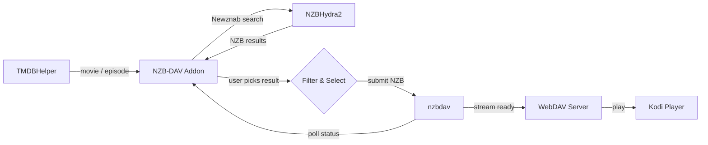

# NZB-DAV Kodi Addon

[](https://github.com/xbmc4lyfe/nzbdavkodi/actions/workflows/ci.yml)
[](https://github.com/xbmc4lyfe/nzbdavkodi/actions/workflows/pylint.yml)
[](https://github.com/xbmc4lyfe/nzbdavkodi/actions/workflows/codeql.yml)
[](https://github.com/xbmc4lyfe/nzbdavkodi/actions/workflows/release.yml)
[](https://www.gnu.org/licenses/gpl-3.0)
[](https://kodi.tv/)
[](https://www.python.org/)

A Kodi 21 (Omega) player/resolver addon that enables Usenet-based streaming through NZBHydra2 and nzbdav. Works as a TMDBHelper player -- search for a movie or TV episode, pick an NZB, and stream it directly through nzbdav's WebDAV server.

## How It Works



No separate SABnzbd needed -- nzbdav handles both downloading and serving.

## Requirements

| Component | Description |
|-----------|-------------|
| **Kodi 21 (Omega)** | Or later |
| **NZBHydra2** | Running and accessible |
| **nzbdav** | Running and accessible (provides SABnzbd-compatible API + WebDAV) |
| **TMDBHelper** | To trigger searches |

## Installation

### Via Kodi Repository (recommended)

Install through the NZB-DAV repository for automatic updates:

1. Download `repository.nzbdav.zip` from the [releases page](../../releases) or [GitHub Pages](https://xbmc4lyfe.github.io/nzbdavkodi/repository.nzbdav/repository.nzbdav.zip)
2. In Kodi: **Settings > Add-ons > Install from zip file** > select `repository.nzbdav.zip`
3. **Settings > Add-ons > Install from repository > NZB-DAV Repository > Video add-ons > NZB-DAV**
4. Future updates are installed automatically

### Manual Install

1. Download `plugin.video.nzbdav.zip` from the [releases page](../../releases)
2. In Kodi: **Settings > Add-ons > Install from zip file** > select `plugin.video.nzbdav.zip`

---

## Configuration

Open the addon settings (**Add-ons > My add-ons > Video add-ons > NZB-DAV > Configure**):

### Connection Settings

| Setting | Description |
|---------|-------------|
| NZBHydra2 URL | URL to your NZBHydra2 instance (e.g., `http://192.168.1.100:5076`) |
| NZBHydra2 API Key | API key from NZBHydra2's config |
| nzbdav URL | URL to your nzbdav instance (e.g., `http://192.168.1.100:3000`) |
| nzbdav API Key | API key from nzbdav's config |
| WebDAV URL | Leave empty to use nzbdav URL, or set a different URL if WebDAV is on a separate port |
| WebDAV Username | Username for WebDAV authentication |
| WebDAV Password | Password for WebDAV authentication |

### Player Installation

Click **Install Player File** to install the `nzbdav.json` player to TMDBHelper. This registers NZB-DAV as a playback source in TMDBHelper's player selection menu.

### Quality Filters

All filters default to **everything enabled** -- deselect what you don't want.

| Filter | Options |
|--------|---------|
| Resolution | 2160p, 1080p, 720p, 480p |
| HDR | HDR10, HDR10+, Dolby Vision, HLG, SDR |
| Audio | Atmos, TrueHD, DTS-HD MA, DTS:X, DD+, DD, AAC |
| Video Codec | x265/HEVC, x264/AVC, AV1, VP9, MPEG-2 |
| Language | EN, ES, FR, DE, IT, PT, NL, RU, JA, KO, ZH, AR, HI |

### Keyword Filters

| Setting | Description |
|---------|-------------|
| Preferred release groups | Comma-separated (e.g., `SPARKS,FGT,NTb`) -- boosted to top |
| Excluded release groups | Comma-separated -- removed from results |
| Min file size | In MB (0 = no limit) |
| Max file size | In MB (0 = no limit) |
| Exclude keywords | Comma-separated |
| Require keywords | Comma-separated |

### Sort & Display

| Setting | Options | Default |
|---------|---------|---------|
| Sort by | Relevance, Size (largest/smallest), Age (newest/oldest) | Relevance |
| Max results | 1--100 | 25 |

### Relevance Sort Order

When sorted by relevance, results are ranked by priority:

| Priority | Criteria | Ranking |
|----------|----------|---------|
| 1 | Resolution | 4K > 1080p > 720p > 480p |
| 2 | HDR | Dolby Vision > HDR10+ > HDR10 > HLG > SDR |
| 3 | Preferred group | Configured groups boosted |
| 4 | Audio | TrueHD+Atmos > Atmos DD+ > TrueHD > DTS:X > DTS-HD MA > DTS > DD+ > DD > AAC |
| 5 | Size | Largest first |

### Polling

| Setting | Description | Default |
|---------|-------------|---------|
| Poll interval | Seconds between status checks | 5 |
| Download timeout | Max wait time in seconds | 3600 |

### Search Cache

| Setting | Description | Default |
|---------|-------------|---------|
| Cache duration | Seconds to cache search results (0 to disable) | 300 |
| Clear Cache | Available from addon main menu | -- |

### Auto-Select

| Setting | Description | Default |
|---------|-------------|---------|
| Auto-select best match | Automatically pick the top result and skip the selection dialog | Off |

---

## Usage

1. Open **TMDBHelper** and browse to a movie or TV episode
2. Select **Play with NZB-DAV**
3. Pick an NZB from the full-screen results dialog
4. Wait for the download to complete (progress dialog shows status)
5. Playback starts automatically from nzbdav's WebDAV server

With **Auto-select best match** enabled, step 3 is skipped automatically.

---

## Development

### Prerequisites

- Python 3.8+
- [just](https://github.com/casey/just) (command runner)

### Commands

```bash
just test          # Run all 132 tests
just test-verbose  # Run tests with full output
just lint          # Check ruff + black formatting
just lint-fix      # Auto-fix lint issues
just release       # Build plugin.video.nzbdav.zip
just ship          # Run tests then build release
just repo          # Build release + generate Kodi repo in dist/
just clean         # Remove build artifacts
just dist-clean    # Remove build artifacts + dist/
```

### Project Structure

```
plugin.video.nzbdav/
  addon.xml              # Kodi addon manifest
  addon.py               # Entry point
  resources/
    settings.xml         # Kodi settings UI
    players/nzbdav.json  # TMDBHelper player template
    lib/
      router.py          # URL routing
      hydra.py           # NZBHydra2 API client
      nzbdav_api.py      # nzbdav API client
      webdav.py          # WebDAV availability checker
      filter.py          # Result filtering with PTT
      results_dialog.py  # Custom full-screen results dialog
      resolver.py        # Download + polling orchestrator
      cache.py           # JSON-based search result cache
      player_installer.py # Player JSON installer
      http_util.py       # Shared HTTP utilities
      playback_monitor.py # Stream failure detection + retry
      ptt/               # Vendored PTT library
    skins/Default/
      1080i/results-dialog.xml  # Dialog skin XML
      media/white.png           # Texture for backgrounds
scripts/
  build_zip.py           # Addon zip builder
  generate_repo.py       # Kodi repo metadata generator
repo/
  repository.nzbdav/     # Repository addon (points to GitHub Pages)
.github/workflows/
  ci.yml                 # Test + lint on push/PR
  release.yml            # Build + deploy on version tags
tests/
  conftest.py            # Kodi module mocks
  test_*.py              # 132 tests
```

### Releasing

1. Bump `version` in `plugin.video.nzbdav/addon.xml`
2. Commit: `git commit -am "release: v0.2.0"`
3. Tag and push: `git tag v0.2.0 && git push origin main v0.2.0`
4. GitHub Actions builds the zip, creates a GitHub Release, and updates the Kodi repo on GitHub Pages
5. Kodi picks up the update automatically via the repository

---

## Compatibility

| Platform | Supported |
|----------|-----------|
| Kodi | 21 (Omega) and later |
| Python | 3.8+ |
| OS | CoreELEC, LibreELEC, OSMC, Windows, macOS, Linux |
| Architecture | ARM64 (aarch64), x86_64 |
| Dependencies | None -- all vendored, no pip required |

## License

GPLv3 -- see [LICENSE](LICENSE) for details.
